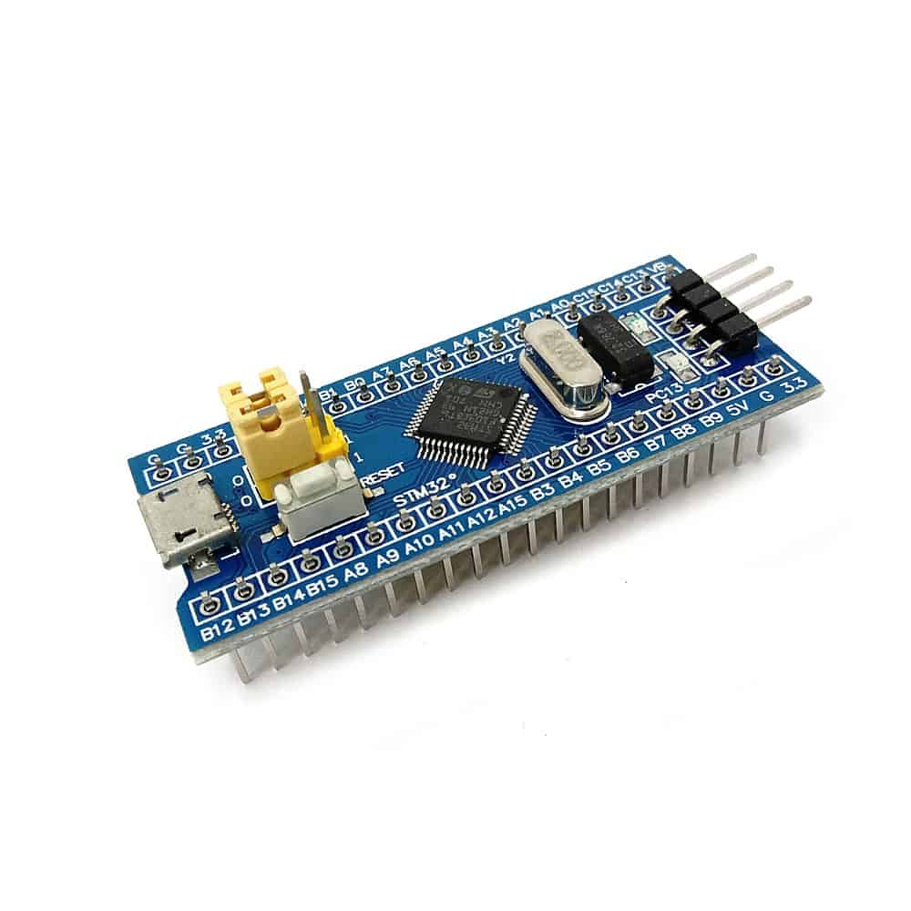
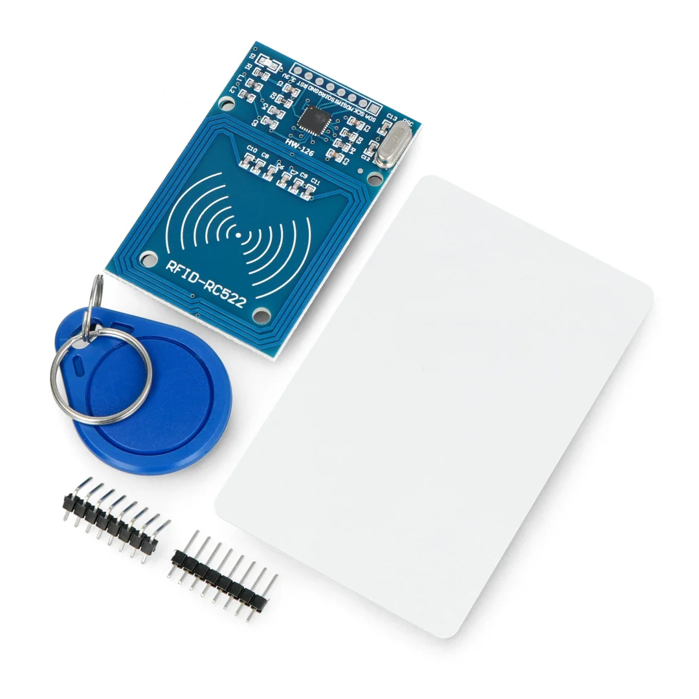
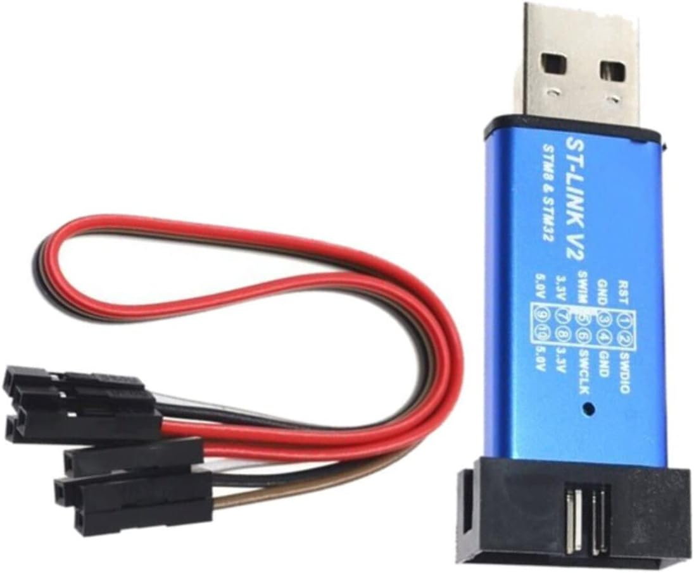
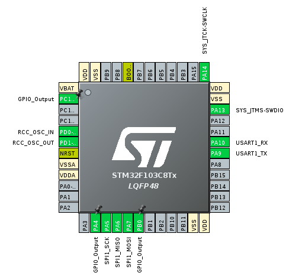
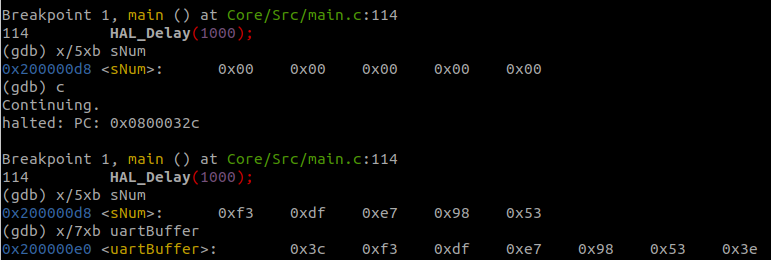

# Compte-rendu TP Systèmes Embarqués
<p align="center">
  <em>MARTELET Curtis / GIORDANO Dylan</em>
<p align="center">

<br>

<p align="center">
  <strong style="font-size: 20px;">Enseignant: <em>S. Druon</em></strong>
</p>

<br><br>

<table width="100%" border="0" style="border-collapse: collapse; border: none;">
  <tr>
    <td align="left"></td>
    <td align="right"></td>
  </tr>
</table>


<div style="page-break-before: always;"></div>


- [Compte-rendu TP Systèmes Embarqués](#compte-rendu-tp-systèmes-embarqués)
  - [**Introduction**](#introduction)
    - [Logiciels](#logiciels)
  - [**1. Configuration Matérielle**](#1-configuration-matérielle)
    - [1.1 Matériel Utilisé](#11-matériel-utilisé)
    - [1.2 Câblage de la carte BluePill](#12-câblage-de-la-carte-bluepill)
      - [*1.2.1 Connexion du module RFID-RC522 au STM32*](#121-connexion-du-module-rfid-rc522-au-stm32)
        - [Principe du SPI](#principe-du-spi)
        - [Câblage entre le module et la carte](#câblage-entre-le-module-et-la-carte)
      - [*1.2.2 Communication UART entre les deux STM32*](#122-communication-uart-entre-les-deux-stm32)
        - [Principe de l'UART](#principe-de-luart)
        - [Câblage entre les deux STM32 via UART](#câblage-entre-les-deux-stm32-via-uart)
      - [*1.2.3 Autres sorties GPIO utilisées*](#123-autres-sorties-gpio-utilisées)
    - [1.3 STM32CubeMX](#13-stm32cubemx)
      - [*1.3.1 Pinout de la carte*](#131-pinout-de-la-carte)
      - [*1.3.2 Choix de l'horloge*](#132-choix-de-lhorloge)
  - [**2. Le Programme**](#2-le-programme)
    - [2.1 Librairie *MFRC522*](#21-librairie-mfrc522)
    - [2.2 Format des données transmises](#22-format-des-données-transmises)
    - [2.3 Le Code](#23-le-code)
      - [*Explication*](#explication)
  - [**3. Communication \& Débogage du STM32**](#3-communication--débogage-du-stm32)
    - [3.1 Problème causé par la puce](#31-problème-causé-par-la-puce)
    - [3.2 Utilisation de OpenOCD \& de GDB](#32-utilisation-de-openocd--de-gdb)
      - [*3.2.1 Connexion à la carte*](#321-connexion-à-la-carte)
      - [*3.2.2 Chargement et Débogage*](#322-chargement-et-débogage)
        - [Chargement du programme](#chargement-du-programme)
        - [Execution du programme](#execution-du-programme)
- [**Conclusion**](#conclusion)
  - [**Résultat**](#résultat)
  - [**Bilan**](#bilan)


<div style="page-break-after: always;"></div>


## **Introduction**

Ce TP a pour objectif d’initier à la programmation sur systèmes embarqués ainsi qu’à la gestion des protocoles de communication, notamment *UART* et *SPI*.  
Il se divise en deux parties distinctes :
- **Lecture** :
Dans un premier temps, un module *RFID* est connecté à une carte programmable. L’objectif est de permettre la lecture d’un badge RFID et d’en extraire son identifiant unique (*ID*).

- **Affichage** :
La seconde partie consiste à connecter un *écran* à une autre carte programmable afin d’afficher du texte. 

L’enjeu principal de ce projet est d’établir une communication entre les deux cartes programmables.
Une fois que la première carte aura lu le badge RFID, il enverra à la seconde carte les données via une liaison série (*UART*). La seconde carte devra alors interpréter ces données et les afficher à l’écran.

Dans le cadre de ce TP, notre rôle est la lecture du badge RFID. 
Pour ce faire, il nous a été fourni un module *RFID-RC522* ainsi qu'une carte programmable *BluePill*. Cette dernièr est basée sur l'architecture *ARM Cortex-M3* et est équipée du microcontrôleur *STM32F103C8T6*. 

Ce compte-rendu détaillera l’ensemble des étapes suivies pour mener à bien cette tâche.  
Nous présenterons dans un premier temps la configuration matérielle, incluant le câblage et les connexions nécessaires entre les différents composants.
Ensuite, nous expliquerons le programme développé pour assurer la lecture du badge et la transmission des données.
Enfin, nous aborderons les outils logiciels utilisés pour programmer et déboguer notre carte, notamment **OpenOCD**, et **GDB**.

### Logiciels

Pour réaliser ce TP, nous nous sommes servis des programmes suivants :
- **STM32CubeMX** : 
  un logiciel propriétaire de *STMicroelectronics* qui permet de configurer la puce facilement. Avec ce dernier, il est facile de configurer l'horloge, les ports GPIOs, les protocoles de communications (UART, SPI, etc.) ou encore les possibles interruptions.

- **GCC** (pour GNU Compiler Collection) : 
  il s'agit d'un compilateur que nous avons utilisé pour générer un programme à partir d'un code en C. Nous utilisons la version *ARM GCC (arm-none-eabi-gcc)*, spécifique aux microcontrôleurs ARM. Dans le cadre de ce projet, nous avons utilisé ma méthode *Makefile* pour compiler notre programme.

- **OpenOCD** (pour Open On-Chip Debugger) : 
- un outil open-source utilisé pour se connecter à un microcontrôleur via *JTAG* ou *SWD*. Pour ce projet, nous avons utilisé *SWD*.

- **GDB** (pour GNU Debugger) : 
  ce programme est un débogueur. Utilisé pour exécuter le programme en mode pas-à-pas, inspecter la mémoire, afficher les registres ou encore placer des points d'arrêt, il nous a permis de déboguer notre programme. Nous utilisons la version *arm-none-eabi-gdb*, la version adaptée aux microcontrôleurs ARM.

- **Librairie MRF522** : 
  il s'agit d'une librairie pour carte Arduino qui a été réécrite pour fonctionner avec les puces STM32. Il facilite l'utilisation d'un module RF522, en gérant la lecture et l'écriture des registres necessaire. 


<div style="page-break-before: always;"></div>


## **1. Configuration Matérielle**

Dans cette section, nous allons détailler les éléments matériels utilisés, leur rôle ainsi que le câblage réalisé pour assurer la communication entre les différents composants du projet.  

### 1.1 Matériel Utilisé

Pour notre partie du projet, nous avons utilisé ces trois éléments :

<p align="center">
  
</p>

- *Carte STM32 (BluePill - STM32F103C8T6)*
  - Microcontrôleur ARM Cortex-M3 cadencé au maximum à 72 MHz. 
  - Dispose de plus de 40 pins, offrant deux interfaces SPIs, UARTs, deux timers programmables, ainsi que bon nombre d'entrées et sorties programmables. 
  - Alimentation en 3.3V.
  - La carte avec laquelle nous avons travaillé utilise une **copie chinoise de la *STM32F103C8T6***. Ce point nous causa quelques torts, nous développerons ces derniers dans la troisième partie du rapport.

<p align="center">
  
</p>

- *Module RFID-RC522*
  - Permet la lecture de cartes RFID.
  - Utilise une communication SPI.
  - Nécessite une alimentation en 3.3V, fourni par la *BluePill*.

<p align="center">
  
</p>

- *Clé USB ST-Link V2*
  - Permet de brancher la carte *BluePill* à un ordinateur pour alimenter et flasher le code via **SWD** (*Serial Wire Debug*).
  - Utilisée avec OpenOCD et GDB pour l’analyse en temps réel du programme.
  - Connectée aux broches **SWDIO** et **SWCLK** de la carte STM32, ainsi que deux broches d'alimentation.

<br>

### 1.2 Câblage de la carte BluePill

Dans cette partie, nous allons nous attarder sur les protocoles de communications ainsi que le câblage que nous avons réalisé sur la carte.

**Pinout de la carte :**


#### *1.2.1 Connexion du module RFID-RC522 au STM32*

Le module **RFID-RC522** est connecté au STM32 via le **bus SPI** de la carte. Nous avons choisi d'utiliser le **SPI1** de la carte.

##### Principe du SPI

Le SPI utilise une **architecture maître-esclave**, où le **STM32** joue le rôle de **maître** et le **lecteur RFID** celui d’**esclave**. La communication repose sur **quatre fils principaux** :  

- **MOSI (Master Out, Slave In)** : ligne utilisée pour **envoyer** des données du STM32 vers le lecteur RFID.  
- **MISO (Master In, Slave Out)** : ligne utilisée pour **recevoir** des données du lecteur RFID vers le STM32.  
- **SCK (Serial Clock)** : signal d'horloge généré par le **maître** (STM32) pour **synchroniser** l’échange de données.  
- **SS (Slave Select)** : signal permettant d’**activer un esclave spécifique** lorsque plusieurs sont connectés sur le même bus SPI. 

##### Câblage entre le module et la carte

| Broche RFID-RC522 | Broche STM32 (*BluePill*) | Fonction |
|-------------------|-----------------|---------------------|
| **3.3** | **3.3V** | Alimentation |
| **GND** | **GND** | Masse |
| **SDA (SS)** | **PA4** | Slave Select (Chip Select - CS) |
| **SCK** | **PA5** | Clock SPI (SCK) |
| **MOSI** | **PA7** | Master Out Slave In (MOSI) |
| **MISO** | **PA6** | Master In Slave Out (MISO) |
| **IRQ** | **NC** *(Non connecté)* | Interruption (optionnel) |
| **RST** | **PB0** | Reset du module |

**Remarque :**  
- Le **SDA** du module RFID-RC522 est en réalité utilisé comme **SS** (Slave Select) dans le mode **SPI**.  
- L’IRQ est une fonctionnalité avancée qui permet d’interrompre le microcontrôleur lorsqu’un badge est détecté. Dans notre cas, il n’est pas utilisé.  
- La connexion **SPI** est en mode **full-duplex**, permettant un échange bidirectionnel des données.  
- Nous devons manuellement définir les ports **PA4** et **PB0** comme étant des *GPIO OUT*, STM32CubeMX ne le faisant pas automatiquement.


#### *1.2.2 Communication UART entre les deux STM32*

En plus du module RFID, nous devons transmettre les données d'une carte STM32 à une **seconde carte STM32** équipée d'un écran. Pour cela, nous utilisons le **protocole UART (Universal Asynchronous Receiver-Transmitter)**, qui permet une communication série **asynchrone** entre les deux cartes.  
Nous nous sommes servi du mode **UART1** de la carte.

##### Principe de l'UART

Contrairement au SPI, **l'UART ne nécessite pas de signal d'horloge partagé** entre les deux microcontrôleurs. La communication repose uniquement sur **deux fils** :

- **TX (Transmit)** : utilisé pour **envoyer** des données.
- **RX (Receive)** : utilisé pour **recevoir** des données.

Pour garantir une transmission correcte, les **deux STM32 doivent être configurés avec les mêmes paramètres de communication**, à savoir :  

- **Baudrate** : 115200 bps  
- **Word length** : 8 bits  
- **Stop bits** : 1  
- **Parité** : Aucune  
- **Mode** : Transmission et réception activés  

##### Câblage entre les deux STM32 via UART

| **Carte RFID (Émettrice)** | **Carte Écran (Réceptrice)** | **Rôle** |
|----------------|----------------|---------------------|
| **TX (PA9)**  | **RX (PA10)**   | Transmission UART |
| **RX (PA10)** | **TX (PA9)**    | Réception UART |
| **GND**       | **GND**         | Masse commune |

**Remarque :**  
- Le fil **TX de la carte RFID** est connecté au **RX de la carte Écran**, et inversement.  
- La **masse (GND)** doit être commune aux deux cartes pour assurer une transmission fiable.  


#### *1.2.3 Autres sorties GPIO utilisées*

En plus de ces deux protocoles de communication, nous utilisons une autre **sortie** GPIO dans ce projet :  

| **Nom** | **Broche STM32** | **Rôle** |
|---------|-----------------|----------|
| **LED intégrée** | **PC13** | S'allume quand une carte est détectée. |


<br>

### 1.3 STM32CubeMX

Maintenant que nous avons la liste des connexions dont nous aurons besoin, nous pouvons les configurer sur le programme. Ce dernier va nous générer un projet qui initialisera la carte avec les paramètres insérés.

#### *1.3.1 Pinout de la carte*

Une fois configuré à l'aide de **STM32CubeMX**, les pins ressemblent à cela : 

<p align="center">
  
</p>


#### *1.3.2 Choix de l'horloge*

En plus de définir les pins de la puce, nous devons également régler l'horloge.

Le microcontrôleur **STM32F103C8T6** dispose d’un oscillateur interne mais peut également être configuré pour utiliser un **oscillateur externe** (**HSE**) afin d’augmenter la stabilité et la précision du signal d’horloge.  
Pour ce projet, nous avons choisi d'utiliser le quartz de la puce.

Dans un premier temps, nous avons configuré l'horloge à **72 MHz**, soit la valeur maximale de la *BluePill*. Cependant, nous avons rencontré des **problèmes de communication** avec le module RFID-RC522. L’échange de données ne se faisait pas correctement si bien que les tentatives de lecture de badge échouaient.

Après plusieurs tests, nous avons réalisé que **la vitesse de communication était trop élevée**, ce qui causait des erreurs dans le protocole **SPI**.  
En effet, si le microcontrôleur fonctionne à une fréquence trop rapide, le module **RFID-RC522** ne parvient pas à suivre le rythme des échanges et les données transmises deviennent corrompues.  
Nous avons résolu ce problème en baissant la vitesse à **8MHz**.


<div style="page-break-before: always;"></div>


## **2. Le Programme**

Après avoir cabler et générer le code de configuration de la carte, nous sommes passé au développement du programme. 
L’objectif de ce dernier est de détecter un badge RFID à proximité du module RFID-RC522, d’extraire son identifiant unique (*UID*), puis de l’envoyer par UART.

<br>

### 2.1 Librairie *MFRC522*

La bibliothèque *MFRC522* nous a été essentielle pour l’interfaçage du module RFID avec la carte STM32. Initialement conçue pour Arduino, cette bibliothèque a été adaptée afin de fonctionner avec les microcontrôleurs STM32, notamment ceux de la famille STM32F1.

Cette bibliothèque offre une simplification des communications avec le RFID-RC522, permettant :

- L’initialisation du module avec la fonction `MFRC522_Init()`.
- La gestion des échanges SPI pour lire et écrire dans les registres internes du RC522.
- La détection des cartes RFID avec `MFRC522_Request()`, qui interroge le module pour vérifier la présence d’un badge.
- La lecture et l'écriture des données de la mémoire de la carte à l'aide des fonctions `MFRC522_Read()` et `MFRC522_Write()`.

<br>

### 2.2 Format des données transmises
Pour garantir une bonne lecture des ID envoyés, nous avons ajouté **des délimiteurs** permettant d'identifier les débuts et fins de messages.  

Exemple d'un message envoyé par UART :  

```
<F3DFE798>
```

Où :  
- **"<"** : Délimiteur de début de message.  
- **"F3DFE798"** : Identifiant de la carte en hexadécimal.  
- **">"** : Délimiteur de fin de message.  

Cela permet à la carte réceptrice de détecter et extraire facilement l'ID du badge sans erreurs.

<br>

### 2.3 Le Code

Voici la fonction main de notre programme, avec des commentaires :
```c
int main(void)
{
  /* Reset of all peripherals, Initializes the Flash interface and the Systick. */
  HAL_Init();

  /* Configure the system clock */
  SystemClock_Config();

  /* Initialize all configured peripherals */
  MX_GPIO_Init();
  MX_SPI1_Init();
  MX_USART1_UART_Init();
  MFRC522_Init();


  int a; // DEBUG: check where we are in the transmission

  /* Main loop */
  while (1)
  {
    a = 0; // DEBUG: start of the loop

    // /* Check if the STM32 is alive */
    // HAL_GPIO_TogglePin(GPIOC, GPIO_PIN_13);

    /* Check if there is a card */
    status = MFRC522_Request(PICC_REQIDL, str);

    if(status == MI_OK) {
      a = 1;  // DEBUG: card detected
      /* Turn on the LED */
      HAL_GPIO_WritePin(GPIOC, GPIO_PIN_13, GPIO_PIN_RESET);

      /* Verify no problem */
      status = MFRC522_Anticoll(str);

      if(status == MI_OK) {
        a = 2;  // DEBUG: card read
        /* Recover the ID number on the card */
        memcpy(sNum, str, 5);

        /* Prepare the message containing the ID starting with '<' and ending with '>'*/
        uartBuffer[0] = '<';
        memcpy(&uartBuffer[1], sNum, 5);  // Copie l'ID
        uartBuffer[6] = '>';

        /* Send the ID with UART */
        HAL_UART_Transmit(&huart1, uartBuffer, 7, 1000);
      }
    }
    else {
      /* Turn off the LED */
      HAL_GPIO_WritePin(GPIOC, GPIO_PIN_13, GPIO_PIN_SET);
    }

    /* Sleep */
    HAL_Delay(1000);
  }
}
```

#### *Explication*

Avant d'entrer dans la boucle principale, nous devons initialiser les périphériques nécessaires :
- **Horloge et GPIOs** : Configuration du système et des broches utilisées.
- **SPI1** : Permet la communication entre la carte et le module RFID-RC522.
- **UART1** : Utilisé pour envoyer les données du badge vers un autre système.
- **Module RFID** : Configuration et mise en route du lecteur via la bibliothèque *MFRC522*.

Une fois l'initialisation faite, nous entrons dans la boucle principale. Cette dernière réalise les étapes suivantes :
- **Détection du badge RFID** :
    - `MFRC522_Request` vérifie si une carte est présente. Nous utilisons l'argument `PICC_REQIDL` qui est une simple récupération d'information d'identification de la carte. 
    - `MFRC522_Anticoll` permet de lire l’ID de la carte en réglant les situations où plusieurs cartes RFID se trouvent simultanément à portée du lecteur. Dans de tels cas, des interférences peuvent survenir, rendant difficile l'identification des cartes. 
    - **Allumage de la LED** : La LED intégrée à la carte (*PC13*) s'allume pour indique qu'elle a détecté une carte.
- **Envoi de l’ID par UART** :
    - L’ID est stocké sous forme de tableau de 5 caractères du type `uint_8`.
    - La fonction `HAL_UART_Transmit` envoie un message d'une taille de 7, c'est à dire l’ID en série sous la forme `<[ID]>`.
- **Extinction de la LED** : Si aucune carte n'a été détectée, la LED intégrée s'éteint.
- **Attente** : une attente de 1s pour éviter une double lecture du badge.


<div style="page-break-before: always;"></div>


## **3. Communication & Débogage du STM32**

Cette dernière partie s'attardera sur l'utilisation de **OpenOCD** et de **GDB** pour se connecter et déboguer la carte sans l'aide de **STM32CubeIDE**, un logiciel propriétaire de *STMicroelectronics*.

<br>

### 3.1 Problème causé par la puce

Comme expliqué dans l'introduction, la carte fournie utilise une puce *STM32F103C8T6* contrefaite. Cela a rendu l'utilisation des outils de développement officiels comme **STM32CubeIDE** impossible, ainsi que **OpenOCD** lorsqu’il est configuré pour une puce *STM32F103C8T6* originale.   
Dans notre cas, nous avons eu des erreurs en essayant d'utiliser **OpenOCD** où la connexion échouait systématiquement avec l’erreur `Error: Could not verify ST device! Abort connection`.

Le problème venait du fait qu'OpenOCD attendait une réponse spécifique de la puce avant d’établir la connexion. Sur les microcontrôleurs clonés, cette réponse diffère légèrement et bloque le processus.
Pour corriger cela, nous avons modifié le fichier de configuration *stm32f1x.cfg*. Nous y avons remplacé la ligne suivante :
```sh
set _CPUTAPID 0x1ba01477
```
Par : 
```sh
set _CPUTAPID 0x2ba01477
```
Cette modification permet à OpenOCD d’accepter l’identifiant **0x2ba01477**, qui est renvoyé par notre puce STM32 contrefaite.

<br>

### 3.2 Utilisation de OpenOCD & de GDB

Maintenant que les fichiers de OpenOCD a été édité pour fonctionner avec notre puce, nous pouvons flasher la carte avec notre programme.

#### *3.2.1 Connexion à la carte*

Pour nous connecter à la carte , nous avons besoin de OpenOCD et de GDB.  
Dans un premier terminal, nous lancons OpenOCD pour nous connecter à la carte. Cette étape necessite le fichier de configuration de notre puce : **stm32f103.cfg**. Nous avons trouvé ce dernier sur le repository de [Rancunefr](https://github.com/Rancunefr/template_bluepill).

Une fois le fichier télécharger, nous entrons la commande suivante : 
```sh
openocd -f ./stm32f103.cfg
```

Nous devrions alors lire à la suite :
```sh
Info : starting gdb server for stm32f1x.cpu on 3333
Info : Listening on port 3333 for gdb connections
```
Ce message confirme que OpenOCD est prêt à accepter des connexions sur le port *3333*.

Une fois ceci fait (et en l'absence d'un message d'erreur), nous lancons GDB dans un second terminal.  
```sh
gdb multiarch
```

Ensuite, nous connectons GBD au serveur OpenOCD en utilisant la commande suivante dans le répertoire du projet :
```sh
target extended-remote localhost:3333
```

Une confirmation doit apparaître pour indiquer que la connexion a bien été établie.


#### *3.2.2 Chargement et Débogage*

##### Chargement du programme
Lors de la compilation du projet, **un fichier `.elf`** est généré. C'est ce fichier que l'on va flasher sur la carte à l'aide de GDB.  
Pour charger ce fichier dans GDB, utilisez la commande suivante :
```sh
file build/[Nom du projet].elf
```

Maintenant que le fichier est chargé dans la mémoire, nous pouvons l'injecter dans la mémoire FLASH du STM32 :
```sh
load
```

Maintenant, le programme est prêt à être exécuté.


##### Execution du programme

GDB offre plusieurs options pour exécuter et analyser le comportement du programme :
- Pour démarrer le programme :
```sh
run
```

<br>

- Pour gérer les points d'arrêt :
```sh
b main.c:[ligne]
```
Cette commande crée un point d'arrêt à la ligne demandée du fichier main.c. 
Si l'on souhaite continuer après un point d'arrêt, il suffit d'utiliser la commande : 
```sh
continue # (ou c)
```

<br>

- Pour afficher une variable :
```sh
print [variable]
```
Cette commande affichera la valeur au format par défaut, soit int. Il est possible de changer le type en le précisant à la suite de la commande `print`, par exemple :
```sh
x/5xb strNum
```
Affichera `0x01 0x23 0x45 0x67 0x89`. Le print peut être omis puisque l'on utilise l'argument `x/`.

Si l'on souhaite afficher les variables à chaque point d'arrêt, on peut utiliser la commande :
```sh
display [variable]
```

Ces commandes permettent d’analyser l’exécution du programme étape par étape et d’observer les valeurs des variables et registres en cours d’exécution.


<div style="page-break-before: always;"></div>


# **Conclusion**

## **Résultat**

À la fin de ce projet, nous avons réussi à lire l’ID des badges RFID fournis à l’aide du module RFID-RC522 et d’une carte STM32 BluePill. La communication entre le STM32 et le module RFID via SPI fonctionne correctement après avoir ajusté la vitesse d’horloge à 8 MHz pour éviter les erreurs de transmission.

<p align="center">
  
</p>

Nous avons également mis en place un système de transmission UART permettant d’envoyer l’ID du badge à une seconde carte STM32 équipée d’un écran. 
Cependant, nous n’avons pas pu tester cette partie, nous ne pouvons donc pas confirmer si la transmission UART fonctionne comme prévu.

## **Bilan**
Ce projet nous a permis d’acquérir une meilleure compréhension des protocoles de communication embarqués, notamment SPI et UART, ainsi que des outils de développement et de débogage sur STM32.
Il nous a également appris à faire face aux problèmes matériels et à adapter nos méthodes de travail en conséquence. Malgré les difficultés rencontrées, nous avons atteint l'objectifs principal de notre partie du TP : lire les badges RFID avec un STM32.